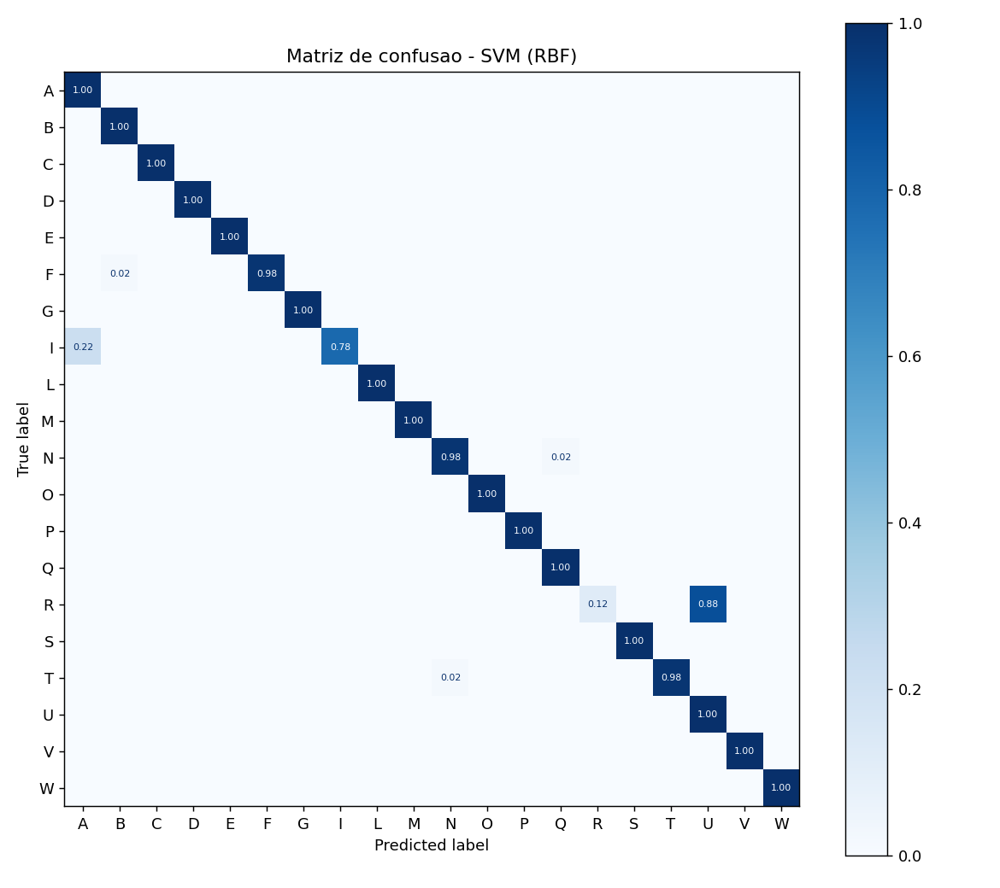
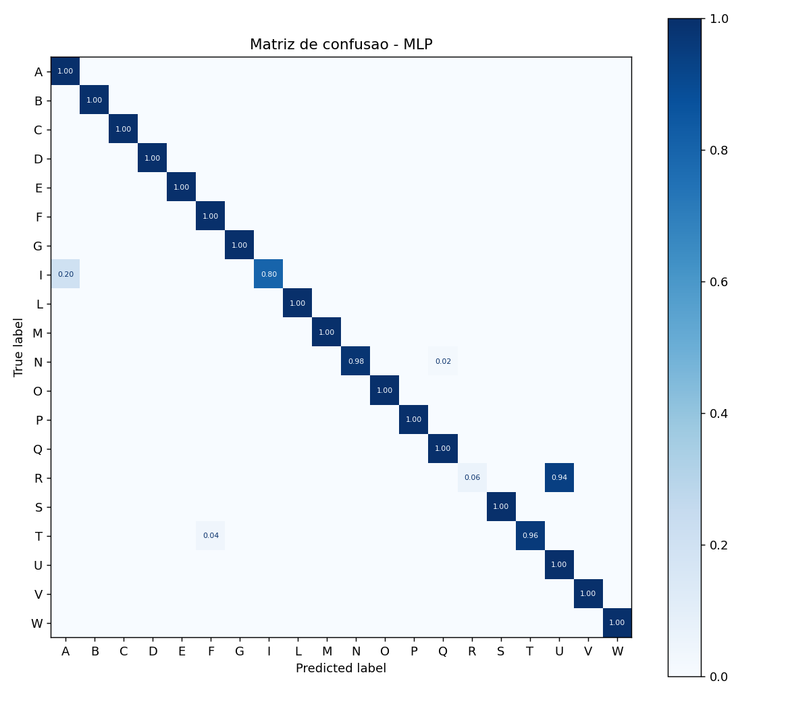
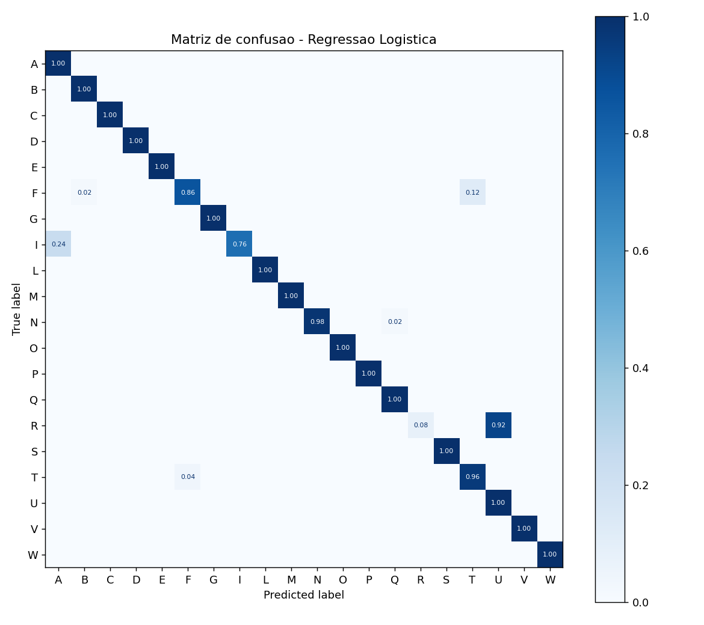
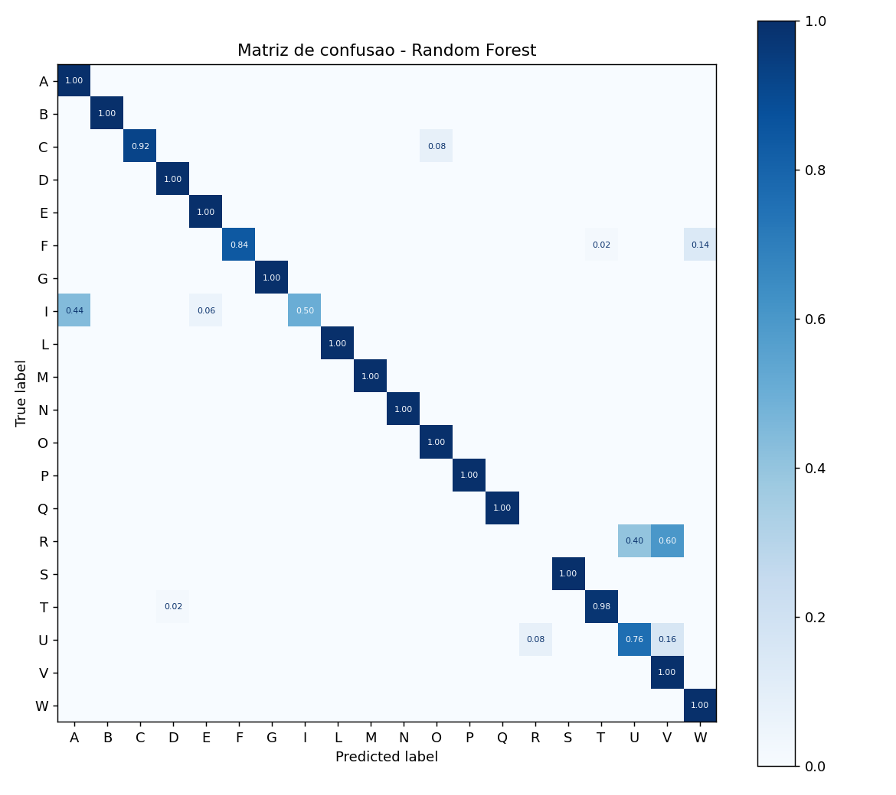

# Relatório Técnico — Avaliação Comparativa dos Classificadores do Libras Vision

**Data:** 2026-06-11  
**Autor da avaliação:** suíte `evaluation/` (reprodutível via `python -m evaluation.run_all`)  
**Semente aleatória global:** 42

---

## 1. Objetivo

Avaliar com rigor estatístico os cinco classificadores que o projeto Libras Vision utiliza para reconhecer o alfabeto manual estático da LIBRAS a partir de *landmarks* de mão (63 atributos extraídos pelo MediaPipe). O estudo (i) compara os modelos entre si, (ii) compara configurações alternativas de hiperparâmetros dentro de cada família e (iii) caracteriza os erros por meio de matrizes de confusão.

## 2. Materiais e métodos

### 2.1 Dados

| Conjunto | Amostras | Classes | Amostras/classe |
| --- | --- | --- | --- |
| Treino | 3989 | 20 | ≈ 200 (194–200) |
| Teste (held-out) | 1000 | 20 | 50 (balanceado) |

O espaço de atributos tem **63 dimensões** (21 *landmarks* × 3 coordenadas), as mesmas consumidas em produção por `libras_vision.py`. As classes são as 20 letras estáticas: `A, B, C, D, E, F, G, I, L, M, N, O, P, Q, R, S, T, U, V, W`. O conjunto de teste é estritamente *held-out*: nunca é usado para treinar ou selecionar hiperparâmetros.

### 2.2 Protocolo experimental

- **Validação cruzada:** `RepeatedStratifiedKFold` (5 folds × 3 repetições = 15 estimativas pareadas), aplicada apenas ao conjunto de treino. Todos os modelos veem exatamente os mesmos folds, o que torna as pontuações pareadas e habilita testes de medidas repetidas.
- **Estimativa de generalização:** cada modelo é re-treinado em todo o treino e avaliado uma única vez no conjunto de teste *held-out*.
- **Métricas:** acurácia, e precisão/revocação/F1 macro e ponderado (macro trata todas as letras igualmente; como o teste é balanceado, macro e ponderado quase coincidem).
- **Testes de significância:** Friedman (omnibus sobre os folds) + Wilcoxon pareado com correção de Holm (post-hoc); McNemar entre os dois melhores modelos no conjunto de teste.
- **Reprodutibilidade:** semente global `42` em todas as divisões e modelos estocásticos.

## 3. Comparação entre modelos

### 3.1 Resultados principais

| Modelo | Acurácia CV (média ± IC95%) | Acurácia teste | F1 macro (teste) | Predição (ms/amostra) |
| --- | --- | --- | --- | --- |
| SVM (RBF) | 99.76% ± 0.09% | 94.20% | 0.9313 | 0.086 |
| MLP | 99.72% ± 0.10% | 94.00% | 0.9266 | 0.002 |
| Regressao Logistica | 99.16% ± 0.12% | 93.20% | 0.9194 | 0.001 |
| KNN | 97.54% ± 0.27% | 90.60% | 0.8886 | 2.196 |
| Random Forest | 99.30% ± 0.18% | 90.00% | 0.8812 | 0.079 |

O melhor modelo no conjunto de teste é **SVM (RBF)** (acurácia 94.20%, F1 macro 0.9313).

### 3.2 Significância estatística

**Teste de Friedman** sobre as pontuações por fold: χ² = 53.93, p = < 0.0001. Há diferença estatisticamente significativa entre os modelos (p < 0,05).

Ranking médio de Friedman (menor é melhor):

| Modelo | Rank médio |
| --- | --- |
| SVM (RBF) | 1.47 |
| MLP | 1.63 |
| Random Forest | 3.20 |
| Regressao Logistica | 3.70 |
| KNN | 5.00 |

**Post-hoc Wilcoxon pareado (correção de Holm).** Pares com p-Holm < 0,05 diferem significativamente:

| Par | Δ acurácia CV | p-Holm | Significativo? |
| --- | --- | --- | --- |
| KNN vs Regressao Logistica | -1.62 pp | 0.0064 | sim |
| KNN vs SVM (RBF) | -2.21 pp | 0.0064 | sim |
| KNN vs Random Forest | -1.75 pp | 0.0064 | sim |
| KNN vs MLP | -2.18 pp | 0.0064 | sim |
| Regressao Logistica vs SVM (RBF) | -0.59 pp | 0.0064 | sim |
| Regressao Logistica vs MLP | -0.56 pp | 0.0064 | sim |
| SVM (RBF) vs Random Forest | +0.46 pp | 0.0064 | sim |
| Random Forest vs MLP | -0.43 pp | 0.0064 | sim |
| Regressao Logistica vs Random Forest | -0.13 pp | 0.3630 | não |
| SVM (RBF) vs MLP | +0.03 pp | 0.4738 | não |

**Teste de McNemar** (SVM (RBF) vs MLP, no teste held-out, método exact): discordâncias b=5, c=3; p = 0.7266. Não há diferença significativa entre os dois melhores modelos — eles são estatisticamente empatados no teste.

### 3.3 Lacuna de generalização (validação cruzada × teste)

| Modelo | Acurácia CV | Acurácia teste | Lacuna |
| --- | --- | --- | --- |
| SVM (RBF) | 99.76% | 94.20% | +5.56 pp |
| MLP | 99.72% | 94.00% | +5.72 pp |
| Regressao Logistica | 99.16% | 93.20% | +5.96 pp |
| KNN | 97.54% | 90.60% | +6.94 pp |
| Random Forest | 99.30% | 90.00% | +9.30 pp |

Todos os modelos exibem uma queda consistente de ~6.7 pp da validação cruzada (≈ 99–100%) para o teste *held-out* (≈ 90–94%). Uma lacuna desse tamanho, sistemática em todas as famílias, é o achado mais importante do estudo: ela indica que a validação cruzada sobre o treino é **otimista**. A causa mais provável é a presença de quadros altamente correlacionados no treino (imagens consecutivas do mesmo gesto/pessoa), que fazem com que cada fold de CV contenha quase-duplicatas das amostras de validação — inflando a acurácia. O teste *held-out*, capturado de forma independente, é portanto a estimativa de generalização confiável; a CV deve ser lida apenas como sinal **relativo** de ordenação entre modelos/configurações, não como acurácia esperada em produção.

## 4. Comparação de configurações (hiperparâmetros)

Cada família foi varrida por validação cruzada estratificada (5 folds) no conjunto de treino. A configuração de produção (repo) está destacada. O teste *held-out* **não** foi usado nesta etapa, para evitar vazamento.

### 4.1 KNN

| # | Configuração | Acurácia CV (média ± IC95%) |
| --- | --- | --- |
| 1 | k=1, weights=uniform | 99.62% ± 0.44% |
| 2 | k=1, weights=distance | 99.62% ± 0.44% |
| 3 | k=3, weights=distance | 99.42% ± 0.46% |
| 4 | k=5, weights=distance | 99.37% ± 0.44% |
| 5 | k=3, weights=uniform | 99.35% ± 0.35% |
| 11 | k=21, weights=uniform ⟵ repo | 97.62% ± 0.75% |

Melhor configuração: `k=1, weights=uniform` (99.62%), +2.01 pp em relação ao repo (`k=21, weights=uniform`, 97.62%). Ganho potencial relevante.

### 4.2 Regressao Logistica

| # | Configuração | Acurácia CV (média ± IC95%) |
| --- | --- | --- |
| 1 | C=10.0 | 99.60% ± 0.20% |
| 2 | C=100.0 | 99.55% ± 0.14% |
| 3 | C=1.0 ⟵ repo | 99.17% ± 0.24% |
| 4 | C=0.1 | 98.42% ± 0.39% |
| 5 | C=0.01 | 94.69% ± 1.28% |

Melhor configuração: `C=10.0` (99.60%), +0.43 pp em relação ao repo (`C=1.0`, 99.17%). Ganho potencial relevante.

### 4.3 SVM

| # | Configuração | Acurácia CV (média ± IC95%) |
| --- | --- | --- |
| 1 | kernel=linear, C=100.0 | 99.82% ± 0.09% |
| 2 | kernel=linear, C=10.0 | 99.77% ± 0.13% |
| 3 | kernel=rbf, C=10.0 ⟵ repo | 99.77% ± 0.13% |
| 4 | kernel=rbf, C=100.0 | 99.77% ± 0.20% |
| 5 | kernel=poly, C=100.0 | 99.57% ± 0.18% |

Melhor configuração: `kernel=linear, C=100.0` (99.82%), +0.05 pp em relação ao repo (`kernel=rbf, C=10.0`, 99.77%). Diferença dentro do intervalo de confiança — sem ganho estatístico claro.

### 4.4 Random Forest

| # | Configuração | Acurácia CV (média ± IC95%) |
| --- | --- | --- |
| 1 | n_estimators=300, max_depth=None ⟵ repo | 99.40% ± 0.20% |
| 2 | n_estimators=300, max_depth=20 | 99.40% ± 0.20% |
| 3 | n_estimators=100, max_depth=None | 99.37% ± 0.19% |
| 4 | n_estimators=100, max_depth=20 | 99.37% ± 0.19% |
| 5 | n_estimators=500, max_depth=None | 99.37% ± 0.22% |

A configuração de produção **já é a melhor** da varredura (99.40%).

### 4.5 MLP

| # | Configuração | Acurácia CV (média ± IC95%) |
| --- | --- | --- |
| 1 | hidden=(128,), alpha=0.0001 | 99.75% ± 0.19% |
| 2 | hidden=(128,), alpha=0.01 | 99.75% ± 0.19% |
| 3 | hidden=(256, 128), alpha=0.01 | 99.75% ± 0.27% |
| 4 | hidden=(256, 128), alpha=0.0001 | 99.72% ± 0.26% |
| 5 | hidden=(128, 64), alpha=0.0001 ⟵ repo | 99.72% ± 0.30% |

Melhor configuração: `hidden=(128,), alpha=0.0001` (99.75%), +0.03 pp em relação ao repo (`hidden=(128, 64), alpha=0.0001`, 99.72%). Diferença dentro do intervalo de confiança — sem ganho estatístico claro.

## 5. Análise de erros — matrizes de confusão

As matrizes de confusão normalizadas por linha de cada modelo estão em `evaluation/figures/`. Abaixo, os pares mais confundidos e as letras mais difíceis por modelo no conjunto de teste.

### SVM (RBF)



**Principais confusões:** R→U (44x, 88.00%); I→A (11x, 22.00%); F→B (1x, 2.00%); N→Q (1x, 2.00%); T→N (1x, 2.00%).

**Letras com menor F1:** R (F1=0.21), U (F1=0.69), I (F1=0.88), A (F1=0.90), N (F1=0.98).

### MLP



**Principais confusões:** R→U (47x, 94.00%); I→A (10x, 20.00%); T→F (2x, 4.00%); N→Q (1x, 2.00%).

**Letras com menor F1:** R (F1=0.11), U (F1=0.68), I (F1=0.89), A (F1=0.91), T (F1=0.98).

### Regressao Logistica



**Principais confusões:** R→U (46x, 92.00%); I→A (12x, 24.00%); F→T (6x, 12.00%); T→F (2x, 4.00%); F→B (1x, 2.00%).

**Letras com menor F1:** R (F1=0.15), U (F1=0.68), I (F1=0.86), A (F1=0.89), F (F1=0.91).

### KNN


**Principais confusões:** R→U (31x, 62.00%); I→A (18x, 36.00%); R→V (18x, 36.00%); F→T (14x, 28.00%); U→V (3x, 6.00%).

**Letras com menor F1:** R (F1=0.04), U (F1=0.70), I (F1=0.78), F (F1=0.80), V (F1=0.80).

### Random Forest



**Principais confusões:** R→V (30x, 60.00%); I→A (22x, 44.00%); R→U (20x, 40.00%); U→V (8x, 16.00%); F→W (7x, 14.00%).

**Letras com menor F1:** R (F1=0.00), I (F1=0.67), U (F1=0.70), V (F1=0.72), A (F1=0.82).

## 6. Discussão e recomendações

1. **Modelo recomendado para produção:** **SVM (RBF)** lidera (94.20% no teste), mas empata estatisticamente com **MLP** (McNemar p=0.7266); a escolha pode considerar custo de predição (0.086 ms/amostra).
2. **Configurações:** ver Seção 4 — quando a melhor configuração está dentro do IC95% da de produção, manter o repo é defensável por simplicidade/velocidade. Destaque: o KNN de produção (`k=21`) fica ~2 pp abaixo de valores menores de `k`; reduzir `k` melhoraria a acurácia, ao custo do índice de confiança suave que motivou `k=21`.
3. **Erro sistemático crítico:** a letra R é mal classificada por **todos** os modelos. As letras mais difíceis, em média entre os cinco classificadores, são: **R** (F1 médio 0.10), **U** (F1 médio 0.69), **I** (F1 médio 0.82), **A** (F1 médio 0.87). O padrão dominante é a confusão R→U / R→V (letras de configuração de mão muito próximas — dedos cruzados/justapostos), além de I→A. Nenhum classificador resolve isso, o que indica que o problema está nos **atributos**, não no modelo: os 63 *landmarks* normalizados não separam bem essas formas. Recomenda-se aumento de dados para R/U/V e/ou atributos adicionais (ângulos entre dedos, distâncias inter-falange) antes de trocar de modelo.
4. **Limitações:** a avaliação usa *landmarks* já extraídos (não mede o erro do detector MediaPipe nem condições de iluminação/câmera reais), e as letras dinâmicas (H, J, K, X, Z) estão fora de escopo. A acurácia de validação cruzada é otimista (Seção 3.3); use o teste *held-out* como referência de generalização.

## 7. Reprodutibilidade

```bash
python -m evaluation.run_all
```

Gera este relatório (`RELATORIO_TECNICO.md`), as figuras em `evaluation/figures/` e os resultados brutos em `evaluation/results.json`.
